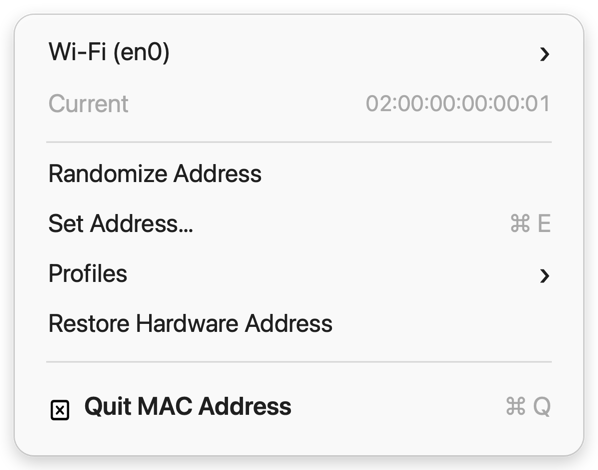

# 🎭 MAC Address

<p align="center">
  
</p>

<p align="center">
  <a href="https://github.com/2xf-org/mac-address/actions/workflows/build.yml">
    
  </a>
</p>

A tiny macOS menu bar app for changing a network interface's MAC address and
switching between saved profiles.

MAC Address discovers the interfaces already attached to your Mac, shows the
current address, and applies custom, random, saved, or hardware addresses in a
click. It has no Dock icon, no third-party service, and no telemetry.

<p align="center">
  
</p>

## Installing

Requires macOS 13+ and Xcode command line tools.

Download the latest app from [Releases](https://github.com/2xf-org/mac-address/releases),
or build it locally:

```sh
./build.sh
open "MAC Address.app"
```

To keep it around, move `MAC Address.app` to `/Applications` and add it to
**System Settings → General → Login Items**.

## Using

- **Interface**: choose a Wi-Fi, Ethernet, Thunderbolt, or other hardware port.
- **Randomize Address**: generate a locally administered unicast address.
- **Set Address…**: apply any valid unicast 48-bit MAC address.
- **Profiles**: save the current address with its interface, apply it later, or
  delete it without changing the active address.
- **Restore Hardware Address**: return the selected interface to the address
  reported by macOS for that hardware port.

macOS asks for administrator approval whenever an address is changed. The
interface may disconnect briefly while its hardware filter is reprogrammed.

## How it works

The app reads hardware ports with `networksetup`, reads live addresses with
`ifconfig`, and uses macOS's standard administrator prompt to run one validated
`ifconfig <device> ether <address>` command. Interface names come from macOS and
are restricted to safe device characters; addresses are parsed and normalized
before the privileged command is created.

Profiles stay local at:

```text
~/Library/Application Support/MAC Address/profiles.json
```

MAC changes are normally temporary. A reboot, reconnect, network setting, or
driver may restore or replace the address. Some hardware drivers do not permit
address changes; the app verifies the reported address and tells you when a
driver rejects the update. Use this tool only on networks you own or are
authorized to test.

## Development

```sh
./test.sh
./build.sh
```

No Xcode project is required. The build script regenerates the app icon, menu
bar glyph, and README artwork before compiling the app bundle.
README artwork is rendered from synthetic data and never reads a live network
interface.

Network glyph drawn for MAC Address and released with the app.
